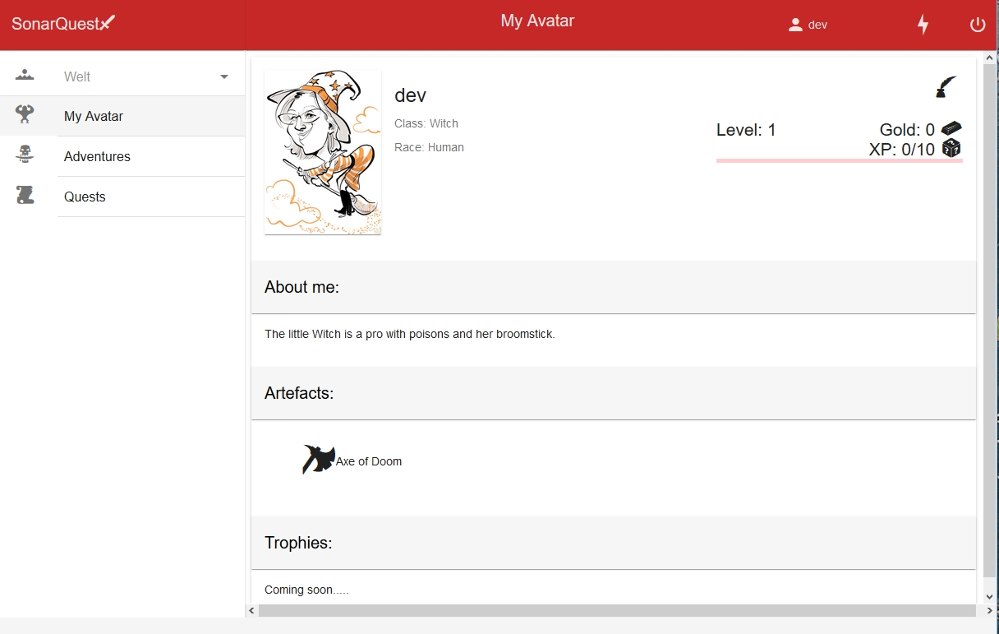

# SonarQuest

A tool for extending [SonarQube](https://www.sonarqube.org/) by a gamification system. Handle your code quality issues in a playful way by solving quests and adventures, earning rewards for refactoring code smells and optimization.

* more about SonarQuest's game concepts and application scenarios: https://www.viadee.de/sonarquest_en
* Sonar Quest info package: https://github.com/viadee/sonarQuest/blob/master/docs/SonarQuest_info_package.pdf

## Goal

Reduce technical debts in your code project by converting the refactoring process into a game. Create quests from SonarQube issues and write your own story.

An example: a team defines the solvation of issues with priority levels "blocker" and "critical" as goals on a fictious adventure map in a game they call "travel through the wild Codeistan". They can reach the respective targets in the adventure by decreasing the number of code smells, bugs and security vulnerabilities detected by SonarQube.

## Getting Started

See [INSTALLATION.md](installation.md) for instruction to get startet with SonarQuest. These instructions will get you a copy of the project up and running on your local machine for development and testing purposes.

### Used technologies and projects
The SonarQuest client is an *Angular* application on the basis of *TypeScript*. *Angular Material*, *Teradata Covalent* and *RPG-Awesome* (Icons) are used for the UI. You need *Node.js* for your development environment.

* [Angular](https://angular.io) (licensed under MIT)
* [Angular Material](https://material.angular.io) (licensed under MIT)
* [Teradata Covalent](https://teradata.github.io/covalent/#/) (licensed under MIT)
* [RPG-Awesome](https://nagoshiashumari.github.io/Rpg-Awesome/) (licensed under BSD 2-Clause)
* [Node.js](https://nodejs.org/en/)
* [express.js](https://expressjs.com/) (licensed under MIT)
* [Spring Boot](https://spring.io/) (licensed under Apache License 2.0)

## Contributing

Interested in helping out? Welcome! Check out the guide  [CONTRIBUTING.md](CONTRIBUTING.md) to get started.

## License

This project is licensed under the BSD 3-Clause "New" or "Revised" License - see the [LICENSE](LICENSE) file for details.
The licenses of the reused components of the SonarQuest server can be found in [Licenses SonarQuestServer](sonarQuest-backend/src/main/resources/licenses/licenses.json).

## User Guidelines

### Player and Avatars

A user can choose an individual avatar with a name, a class (e.g. warrior or magician) and a race (e.g. dwarf or elf). A set of predefined avatars is available [here in PDF format](AvatarCards.pdf). 
Please note the username (login) is the character's name by default (first letter is always uppercase!) and the standard password is `test` for all accounts.

During an adventure the party (which may be represented by a project team) takes on quests and every avatar has several possibilities to gain experience points (XP) and get to the next level. Besides, some quests and tasks contain a reward in form of gold -- which can be used to purchase items and improvements in the marketplace.

The levels are determined based on experience points (XP) as follows:

#### Levels

| Level | 1 | 2  | 3  | 4  | 5  | 6  | 7  | 8  |
|-------|---|----|----|----|----|----|----|----|
| XP    | 0 | 10 | 30 | 60 | 100| 150| 210| 280|

Levels 1 to 100 are included in the standard game data. In case you want to add some extra levels, consider reading the [level calculation documentation](docs/SonarQuest_Level_Calculation.ods). 

#### Rating system
Every issue is assessed in experience points and gold. The higher the severity of a issue the more experience points that a user gets.
* Blocker = 10 XP
* Critical = 7 XP
* Major = 5 XP
* Minor = 2 XP
* Info = 1 XP

The number of gold is calculated depending on the effort (minutes/10), e.g. approximately 30 minutes = 3 gold, 2 hours = 12 gold.
Thus issues with a low severity and a high effort are also attractive for a user.

### Quests and Administration

A "Game-Master" is responsible for the administration of quests and adventures and assigning issues from SonarQube to them. This process is supported by automatic generation: The results from the previous SonarQube-Build are being loaded and evaluated using the severity the effort to solve them. Subsequently, the issues are randomly grouped to predefined quests. These can be assigned to team adventures.
When a quest is solved, i.e. the related SonarQube issues don't exist anymore, the avatar receives the reward.

Additionally, a Game Master is able to manually create "special tasks" which are rewarded by bonus experience points or bonus gold, such as:

- Increase the coverage of a changed class for 10%
- Increase the documentation quality of a changed class
- Apply the DRY principle in one class
